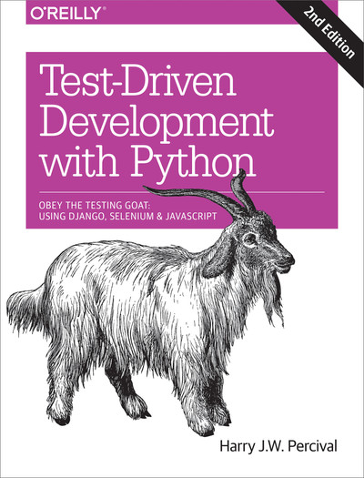

# Test-Driven Development with Python, 2nd Edition

> Minhas **notas** e **códigos** do livro.



## Conteúdo

 - **Prerequisites and Assumptions:**
   - [Introdução e Instalação do Geckodriver](#geckodriver)
 - **Chapter 1. Getting Django Set Up Using a Functional Test:**
   - [Criando um projeto Django com django-admin.py](#django-admin-py)
   - [Adicionando arquivos ao .gitignore com o comando "echo"](#gitignore)
 - **Chapter 02:**
   - [TESTE FUNCIONAL == TESTE DE ACEITAÇÃO == TESTE PONTA A PONTA == CAIXA PRETA](#funcional-test-type)
   - [Teste: Falha esperada](#done-error)
   - [Utilizando o "git diff" para ver o que foi alterado a partir do último commit](#git-diff)
   - [Utilizando o comando "git commit -a"](#commit-a)
 - **Chapter 03:**
   - [Diferença entre Testes Funcionais & Testes de Unidade](#funcional-unidade)
   - [Utilizando o comando "git commit -am"](#commit-am)
 - **Chapter 04:**
 - **Chapter 05:**
 - **Chapter 06:**
 - **Chapter 07:**
 - **Chapter 08:**
 - **Chapter 09:**
 - **Chapter 10:**
 - **Chapter 11:**
 - **Chapter 12:**
 - **Chapter 13:**
 - **Chapter 14:**
 - **Chapter 15:**
 - **Chapter 16:**
 - **Chapter 17:**
 - **Chapter 18:**
 - **Chapter 19:**
 - **Chapter 20:**
 - **Chapter 21:**
 - **Chapter 22:**
 - **Chapter 23:**
 - **Chapter 24:**
 - **Chapter 25:**
 - **Chapter 26:**
 - **Appendix:**
   - **Appendix A. PythonAnywhere:**
   - **Appendix B. Django Class-Based Views:**
   - **Appendix C. Provisioning with Ansible:**
   - **Appendix D. Testing Database Migrations:**
   - **Appendix E. Behaviour-Driven Development (BDD):**
   - **Appendix F. Building a REST API: JSON, Ajax, and Mocking with JavaScript:**
   - **Appendix G. Django-Rest-Framework:**
   - **Appendix H. Cheat Sheet:**

---

<div id="geckodriver"></div>

## Introdução e Instalação do Geckodriver

> Bem, resumidamente o **Geckodriver** é o *driver* que nos permitirá controlar remotamente o **Firefox** via Selenium.

Geckodriver está disponível em [https://github.com/mozilla/geckodriver/releases](https://github.com/mozilla/geckodriver/releases). Você precisa fazer o download, extraí-lo e colocá-lo em algum lugar no caminho do sistema.

**NOTE:**  
Para **Windows**, você pode simplesmente colocá-lo na mesma pasta que o código deste livro - ou se você colocá-lo na pasta Python *Scripts*, ele estará disponível para outros projetos.

**NOTE:**  
Para **macOS** ou **Linux**, um local conveniente para colocá-lo é **/usr/local/bin** *(você precisará sudo disso)*.

Para testar se isso está funcionando, abra um console Bash e você deverá ser capaz de executar:

```
$ geckodriver --version
```

**OUTPUT:**  
```
geckodriver 0.30.0 (d372710b98a6 2021-09-16 10:29 +0300)

The source code of this program is available from
testing/geckodriver in https://hg.mozilla.org/mozilla-central.

This program is subject to the terms of the Mozilla Public License 2.0.
You can obtain a copy of the license at https://mozilla.org/MPL/2.0/.
```

---

<div id="django-admin-py"></div>

## Criando um projeto Django com django-admin.py

A primeira etapa para colocar o Django em funcionamento é criar um projeto, que será o contêiner principal de nosso site. Django fornece uma pequena ferramenta de linha de comando para isso:

```python
$ django-admin.py startproject superlists .
```

**NOTE:**  
Não se esqueça do **“.”** no fim; é importante!

---

<div id="gitignore"></div>

## Adicionando arquivos ao .gitignore com o comando "echo"

Agora vamos dar uma olhada e ver quais arquivos queremos enviar, para isso vamos utilizar o comando **ls**:

```
ls
```

**OUTPUT:**
```
db.sqlite3 
function_tests.py 
geckodriver.log 
manage.py 
superlists 
virtualenv
```

Existem algumas coisas aqui que não queremos sob controle de versão:

 - **db.sqlite3**
   - É o arquivo de banco de dados
 - **geckodriver.log**
   - Contém a saída de depuração do Selenium
 - **virtualenv**
   -  E, finalmente, nosso virtualenv também não deve estar no git.

Vamos adicionar todos eles a um arquivo especial chamado **.gitignore** que, hum, diz ao Git o que deve ser ignorado:

```python
$ echo "db.sqlite3" >> .gitignore
$ echo "geckodriver.log" >> .gitignore
$ echo "virtualenv" >> .gitignore
```

---

<div id="funcional-test-type"></div>

## TESTE FUNCIONAL == TESTE DE ACEITAÇÃO == TESTE PONTA A PONTA == CAIXA PRETA

O que eu chamo de **testes funcionais**, algumas pessoas preferem chamar de:

 - Testes de aceitação;
 - Testes ponta a ponta;
 - Testes de Caixa Preta.

**NOTE:**  
O ponto principal é que esses tipos de testes examinam como todo o aplicativo funciona, ***de fora***.

**NOTE:**  
Outro termo é **teste de caixa preta**, porque o teste não sabe nada sobre os componentes internos do sistema em teste.

---

<div id="done-error"></div>

## Teste: Falha esperada

Bem, agora nós vamos aprender um conceito simples e interessante relacionados a testes que nós conhecemos como ***Falha esperada***. Vamos começar com um exemplo de teste que verifica o título da nossa página Django.

Algo parecido com isso **funcional_tests.py**:

```python
from selenium import webdriver

browser = webdriver.Firefox()

browser.get('http://localhost:8000')
assert 'To-Do' in browser.title
browser.quit()
```

**NOTE:**  
Se você rodar esse teste de fato nós vamos ter uma **falha** e isso ja era esperado desde o início do teste - Isso é o que nós conhecemos como ***Falha esperada***.

Isso na verdade é uma boa notícia - não tão boa quanto um teste que passa, mas pelo menos está falhando pelo motivo certo; podemos ter certeza de que escrevemos o teste corretamente.

---

<div id="git-diff"></div>

## Utilizando o "git diff" para ver o que foi alterado a partir do último commit

Ok, agora suponha que nós fizemos várias alterações nos nossos códigos e queremos saber o que foi alterado em relação ao último commit, como saber?

Uma abordagem seria utilizar o comando **git diff** que retorna o que foi alterado em relação ao último commit.

Primeiro nós utilizamos um **git status** e depois o **git diff** para ter um feedback geral:

```python
$ git status
$ git diff

diff --git a / function_tests.py b / function_tests.py
índice d333591..b0f22dc 100644
--- a / function_tests.py
+++ b / function_tests.py
@@ -1,6 +1,45 @@
 from selenium import webdriver
+ unidade de importação teste

-browser = webdriver.Firefox ()
-browser.get ('http: // localhost: 8000')
+ classe NewVisitorTest (unittest.TestCase):

-assertar 'Django' em browser.title
+ def setUp (self):
+ self.browser = webdriver.Firefox ()
+
+ def tearDown (self):
+ self.browser.quit ()
[...]
```

---

<div id="commit-a"></div>

## Utilizando o comando "git commit -a"

Não sei se vocês notaram, mas nós não adicionamos nenhum arquivo novo no nosso projeto. Ou seja, não vamos precisar utilizar o comando **"git add"**.

Sabendo disso (Que apenas fizemos mudanças sem adicionar nenhum arquivo novo) nós podemos utilizar o comando **git commit -a**.

O comando **git commit -a** significa:

 - Aadicionar automaticamente quaisquer alterações em arquivos rastreados (ou seja, todos os arquivos que já comitados antes).
 - Ele NÃO adicionará nenhum arquivo novo (você mesmo terá que explicitamente git add).

**NOTE:**  
Mas frequentemente, como neste caso, não há nenhum arquivo novo, então é um atalho útil.

---

<div id="funcional-unidade"></div>

## Diferença entre Testes Funcionais & Testes de Unidade

É normal no início da carreira desenvolvedores saírem fazendo testes dos seus códigos sem saber diferenciar os **Testes Funcionais** & **Testes de Unidade**. Mas se você assim como eu desejam saber o que estão fazendo e fazer da maneira correta é muito interessante sabe diferenciar esses 2 tipos de testes.

Uma distinção básica sobre esses 2 tipos de testes podem ser a seguinte:

 - Os testes funcionais testam o aplicativo de fora, do ponto de vista do usuário:
   - Por exemplo, os requisitos.
 - Os testes de unidade testam o aplicativo por dentro, do ponto de vista do programador.

A abordagem TDD que estou seguindo deseja que nosso aplicativo seja coberto por ambos os tipos de teste. Nosso fluxo de trabalho será mais ou menos assim:

 - **STEP-01 - TESTE FUNCIONAL:**
   - Começamos escrevendo um **teste funcional**, descrevendo a nova funcionalidade do ponto de vista do usuário.
     - Assim que tivermos um teste funcional que falhou, começamos a pensar em como escrever um código que possa fazer com que ele seja aprovado (ou pelo menos supere sua falha atual).
 - **STEP-02 - TESTE DE UNIDADE:**
   - Agora usamos um ou mais testes de unidade para definir como queremos que nosso código se comporte - a ideia é que cada linha de código de produção que escrevemos deve ser testada por (pelo menos) um de nossos testes de unidade.
   - Assim que tivermos um teste de unidade com falha, escrevemos a menor quantidade possível de código de aplicativo, apenas o suficiente para que o teste de unidade seja aprovado.

**NOTE:**  
Você pode ver que, do começo ao fim:

 - os **testes funcionais** estão conduzindo o desenvolvimento que fazemos em um ***alto nível***.
 - Enquanto os **testes de unidade** conduzem o que fazemos em ***baixo nível***.

**NOTE:**  
Isso parece um pouco redundante? Às vezes, pode parecer assim, mas os testes funcionais e os testes de unidade realmente têm objetivos muito diferentes e geralmente acabam parecendo bem diferentes.

**Para finalizar você deve ter em mente que:**

 - Os **testes funcionais** devem ajudá-lo a construir um aplicativo com a `funcionalidade certa` e garantir que você nunca o interrompa acidentalmente.
 - Os **testes de unidade** devem ajudá-lo a escrever um código limpo e sem erros.

---

<div id="commit-am"></div>

## Utilizando o comando "git commit -am"

Quando nós utilizamos o comando **"git commit -am"** isso significa que nós estamos utilizando os seguintes comandos em conjunto:

```
git commit -a
git commit -m
```

**NOTE:**  
Ou seja, suponha que nós apenas fizemos algumas alterações e não temos novos arquivos para adicionar com o comando **git add** e também queremos deixar uma mensagem no commit, basta utilizar o comando **"git commit -am"**.

---

<div id=""></div>

## x

x

---

<div id=""></div>

## x

x

---


<div id=""></div>

## x

x

---

<div id=""></div>

## x

x

---

<div id=""></div>

## x

x

---

<div id=""></div>

## x

x

---

<div id=""></div>

## x

x

---

<div id=""></div>

## x

x

---

<div id=""></div>

## x

x

---

<div id=""></div>

## x

x

---


<div id=""></div>

## x

x

---

<div id=""></div>

## x

x

---

<div id=""></div>

## x

x

---

<div id=""></div>

## x

x

---

<div id=""></div>

## x

x

---

<div id=""></div>

## x

x

---

<div id=""></div>

## x

x

---

<div id=""></div>

## x

x

---


<div id=""></div>

## x

x

---

<div id=""></div>

## x

x

---

<div id=""></div>

## x

x

---

<div id=""></div>

## x

x

---

<div id=""></div>

## x

x

---

<div id=""></div>

## x

x

---

<div id=""></div>

## x

x

---

<div id=""></div>

## x

x

---


<div id=""></div>

## x

x

---

<div id=""></div>

## x

x

---

<div id=""></div>

## x

x

---

<div id=""></div>

## x

x

---

<div id=""></div>

## x

x

---

<div id=""></div>

## x

x

---

<div id=""></div>

## x

x

---

<div id=""></div>

## x

x

---


**REFERENCE:**  
[Test-Driven Development with Python, 2nd Edition](https://learning.oreilly.com/library/view/test-driven-development-with/9781491958698/)
